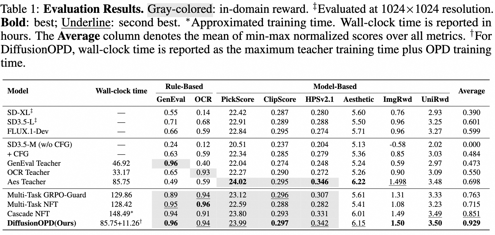

<h1 align="center"> DiffusionOPD:<br>A Unified Perspective of On-Policy Distillation in Diffusion Models </h1>
<div align="center">
  <a href='https://arxiv.org/abs/2605.15055'></a>  &nbsp;
  <a href='https://quanhaol.github.io/DiffusionOPD-site/'></a> &nbsp;
  <a href='https://huggingface.co/'></a> &nbsp;
  <a href='https://github.com/ali-vilab/DiffusionOPD'></a> &nbsp;
</div>

## Overview

**DiffusionOPD** introduces an online policy distillation framework for multi-task diffusion alignment. Instead of jointly optimizing several rewards from scratch or cascading RL stages, it first learns task-specialized teachers and then distills their capabilities into one unified student along the student's own rollout trajectories.

-   **Decoupled Multi-Stage Training:** Single-task exploration is handled independently by task-specific teachers, while the final student focuses on integrating their capabilities, reducing reward conflict and catastrophic forgetting.
-   **Principled Diffusion OPD Objective:** We extend OPD from discrete token generation to continuous diffusion Markov processes and derive a closed-form per-step KL objective for denoising transitions.
-   **Lower-Variance and Sampler-Compatible:** The analytic objective avoids the extra score-function noise in PPO-style policy gradients and naturally covers both stochastic SDE samplers and deterministic ODE samplers through transition/mean matching.
-   **Strong Multi-Domain Results:** DiffusionOPD consistently improves training efficiency and final performance across aesthetics, OCR, and GenEval, outperforming multi-reward RL and cascade RL baselines.

<p align="center">
  
</p>

DiffusionOPD follows a simple two-stage recipe:

1.  **Train Task-Specific Teachers:** Decompose the target capabilities into individual tasks, such as aesthetics, OCR, and GenEval, and train one teacher per task using an off-the-shelf diffusion RL algorithm.
2.  **Initialize a Unified Student:** Start the student policy from the pretrained diffusion model.
3.  **Round-Robin On-Policy Distillation:** For each training round, sample prompts from every task, roll out the current student to obtain on-policy denoising trajectories, and query the corresponding task-specific teacher for supervision at the states visited by the student.
4.  **Accumulate Full-Task Supervision:** Compute the OPD loss for each task using the closed-form KL objective, accumulate losses across all tasks, and update the student once per round.

<p align="center">
  
</p>

## Environment Setup
Our implementation is based on the [DiffusionNFT](https://github.com/NVlabs/DiffusionNFT)  codebase, with most environments aligned.

Clone this repository and install packages by:
```bash
git clone https://github.com/ali-vilab/DiffusionOPD.git
cd DiffusionOPD

conda create -n DiffusionOPD python=3.10.16
pip install torch==2.6.0 torchvision==0.21.0 --index-url https://download.pytorch.org/whl/cu126
pip install -e .
```

## Model Download
To avoid redundant downloads and potential storage waste during multi-GPU training, please pre-download the required models in advance.

**Models**
* **SD3.5**: `stabilityai/stable-diffusion-3.5-medium`
* **GenEval Teacher**: `quanhaol/GenEval-Teacher`
* **OCR Teacher**: `quanhaol/OCR-Teacher`
* **Aes Teacher**: `quanhaol/Aes-Teacher`

## Reward Preparation

Our supported reward models include [GenEval](https://github.com/djghosh13/geneval), [OCR](https://github.com/PaddlePaddle/PaddleOCR), [PickScore](https://github.com/yuvalkirstain/PickScore), [ClipScore](https://github.com/openai/CLIP), [HPSv2.1](https://github.com/tgxs002/HPSv2), [Aesthetic](https://github.com/christophschuhmann/improved-aesthetic-predictor), [ImageReward](https://github.com/zai-org/ImageReward) and [UnifiedReward](https://github.com/CodeGoat24/UnifiedReward). We additionally support `HPSv2.1` on top of FlowGRPO, and simplify `GenEval` from remote server to local. 

### Checkpoints Downloading

```bash
mkdir reward_ckpts
cd reward_ckpts
# Aesthetic
wget https://github.com/christophschuhmann/improved-aesthetic-predictor/raw/refs/heads/main/sac+logos+ava1-l14-linearMSE.pth
# GenEval
wget https://download.openmmlab.com/mmdetection/v2.0/mask2former/mask2former_swin-s-p4-w7-224_lsj_8x2_50e_coco/mask2former_swin-s-p4-w7-224_lsj_8x2_50e_coco_20220504_001756-743b7d99.pth
# ClipScore
wget https://huggingface.co/laion/CLIP-ViT-H-14-laion2B-s32B-b79K/resolve/main/open_clip_pytorch_model.bin
# HPSv2.1
wget https://huggingface.co/xswu/HPSv2/resolve/main/HPS_v2.1_compressed.pt
cd ..
```

### Reward Environments

```bash
# GenEval
pip install -U openmim
mim install mmengine
git clone https://github.com/open-mmlab/mmcv.git
cd mmcv; git checkout 1.x
MMCV_WITH_OPS=1 FORCE_CUDA=1 pip install -e . -v
cd ..

git clone https://github.com/open-mmlab/mmdetection.git
cd mmdetection; git checkout 2.x
pip install -e . -v
cd ..

pip install open-clip-torch clip-benchmark

# OCR
pip install paddlepaddle-gpu==2.6.2
pip install paddleocr==2.9.1
pip install python-Levenshtein

# HPSv2.1
pip install hpsv2x==1.2.0

# ImageReward
pip install image-reward
pip install git+https://github.com/openai/CLIP.git
```

For `UnifiedReward`, we deploy the reward service using sglang. To avoid conflicts, first create a new environment and install sglang with:

```bash
pip install "sglang[all]"
```

Then launch the service with:

```bash
python -m sglang.launch_server --model-path CodeGoat24/UnifiedReward-7b-v1.5 --api-key flowgrpo --port 17140 --chat-template chatml-llava --enable-p2p-check --mem-fraction-static 0.85
```

Memory usage can be reduced by lowering `--mem-fraction-static`, limiting `--max-running-requests`, and increasing `--data-parallel-size` or `--tensor-parallel-size`.


## Training
The default configuration file `config/opd.py` is set for 8 GPUs, and you can customize it as needed.

Single-node training example:
```bash
# Single Teacher
bash scripts/single_node/sopd.sh

# Multi Teacher
bash scripts/single_node/mopd.sh
```

## Evaluation

<p align="center">
  
</p>

The evaluation process follows DiffusionNFT, and we provide an inference script here for loading LoRA checkpoints and running evaluation.

```bash
bash scripts/single_node/eval.sh
```

The `--dataset` flag supports `geneval`, `ocr`, `pickscore`, and `drawbench`.

## Acknowledgement
We thank the [Flow-GRPO](https://github.com/yifan123/flow_grpo) and [DiffusionNFT](https://github.com/NVlabs/DiffusionNFT) projects for providing the awesome open-source diffusion RL codebase.

## Citation
```
@article{li2026diffusionopd,
  title={DiffusionOPD: A Unified Perspective of On-Policy Distillation in Diffusion Models},
  author={Li, Quanhao and Yu, Junqiu and Jiang, Kaixun and Wei, Yujie and Xing, Zhen and Li, Pandeng and Chu, Ruihang and Zhang, Shiwei and Liu, Yu and Wu, Zuxuan},
  journal={arXiv preprint arXiv:2605.15055},
  year={2026}
}
```
